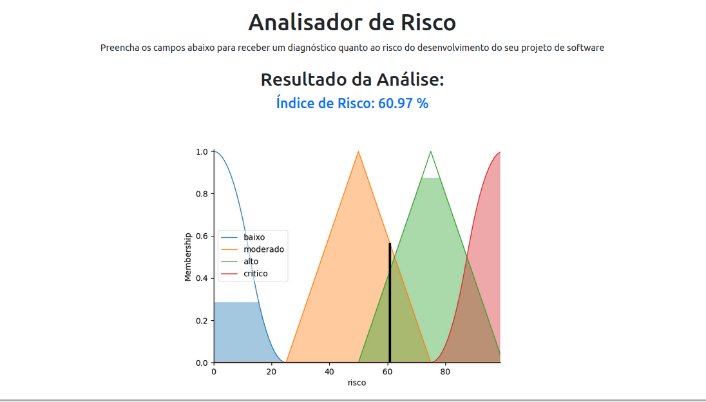

# SoftRisk - Gemini

SoftRisk é um sistema baseado em lógica fuzzy desenvolvido em pair programming com o Google Gemini, objetivando avaliar o nível de risco de projetos de software. Utilizando 12 variáveis principais que influenciam o risco de um projeto, SoftRisk é capaz de lidar com incertezas e subjetividades, fornecendo análises confiáveis e visuais para apoiar a tomada de decisão em grandes empresas.

## Instalação

- Certifique-se de que tem o [Poetry](https://python-poetry.org/docs/) instalado
- Clone o repositório: `git clone https://github.com/ThiagoORuby/pair-programming-project-ia.git`
- Rode os comandos do poetry: `poetry install` e `poetry shell`

## Como Usar ?

```bash
flask run --port NUMBER
```

## A Aplicação



